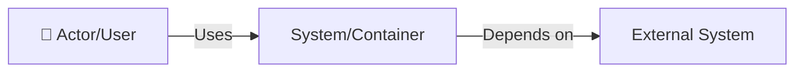

# HR Backend - Architecture Documentation

This directory contains the architecture documentation for the HR Backend system, following the [C4 model](https://c4model.com/) for visualizing software architecture.

## Document Index

### Architecture Diagrams (C4 Model)

1. **[C4 Context Diagram](./architecture/01-context.md)** ✅ - System context and external actors
2. **[C4 Container Diagram](./architecture/02-container.md)** ✅ - High-level technology choices and responsibilities  
3. **[C4 Component Diagram](./architecture/03-component.md)** ✅ - Internal structure of the REST API container

### Guides & Plans

1. **[MapStruct Migration Plan](./MAPSTRUCT_MIGRATION.md)** ✅ - Complete guide for adopting MapStruct for DTO mapping

### Deployment

- **[Dockerfile](../Dockerfile)** ✅ - Production-ready multi-stage build (fast-jar mode)
- **[docker-compose.yml](../docker-compose.yml)** ✅ - Local development environment
- **Terraform** ❌ - AWS infrastructure as code (not yet created)

## C4 Model Overview

The C4 model is a hierarchical set of diagrams for visualizing software architecture:

- **Level 1 - Context**: Shows the system in its environment with external actors and systems
- **Level 2 - Containers**: Shows the high-level shape of the architecture (applications, databases, etc.)
- **Level 3 - Components**: Zooms into individual containers to show components and their interactions
- **Level 4 - Code**: (Not included) - Class diagrams, ER diagrams (use IDE for this)

All diagrams are written in Mermaid syntax and can be viewed in:
- GitHub (native support)
- VS Code (with Mermaid extension)
- IntelliJ IDEA (with Mermaid plugin)
- Any Markdown viewer with Mermaid support

## How to Read These Diagrams

### Notation

### Color Coding

- **Blue boxes**: Internal systems/containers you own
- **Gray boxes**: External systems/dependencies
- **Green text**: Successful/happy path
- **Red text**: Error/exception path

## Quick Start

1. Start with the [Context Diagram](./architecture/01-context.md) to understand the big picture
2. Move to the [Container Diagram](./architecture/02-container.md) for technology stack
3. Deep dive into [Component Diagram](./architecture/03-component.md) for internal structure

## Contributing

When modifying the architecture:

1. Update the relevant diagram(s)
2. Keep diagrams in sync with code
3. Add rationale for major decisions in the diagram files
4. Follow C4 model conventions

## References

- [C4 Model Website](https://c4model.com/)
- [Mermaid Documentation](https://mermaid-js.github.io/)
- [Architecture Decision Records (ADRs)](https://adr.github.io/) - For documenting key decisions
