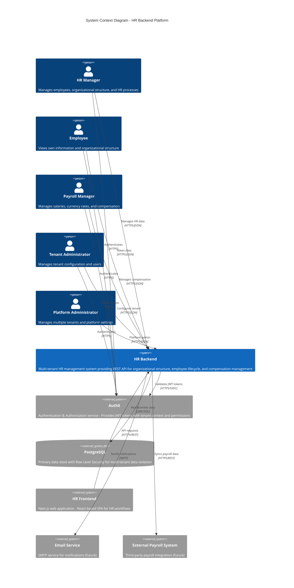
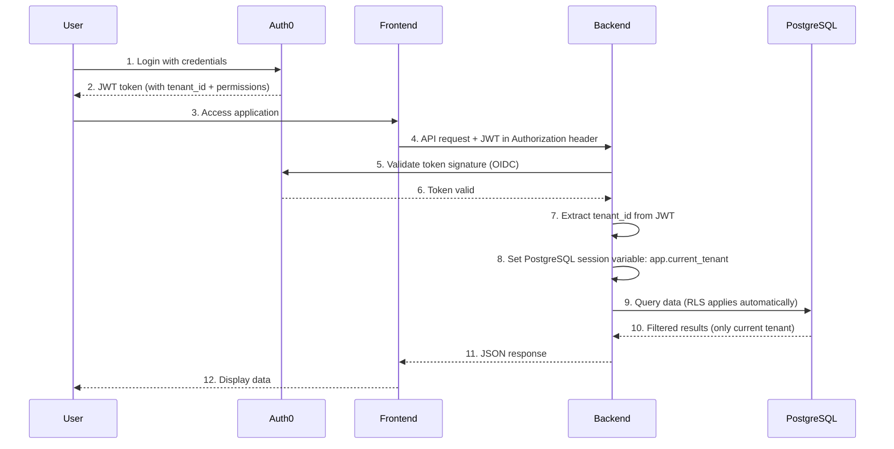
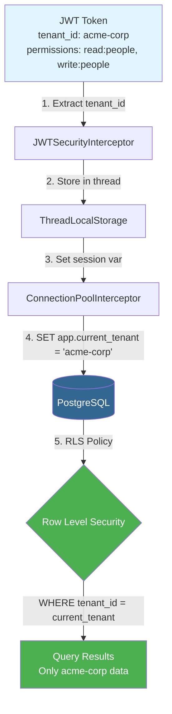

# C4 Context Diagram - HR Backend

## Level 1: System Context

This diagram shows the HR Backend system in its environment, including all external actors and systems it interacts with.

## System Purpose

**HR Backend** is a comprehensive SaaS platform for Human Resources management that provides:

- **Multi-tenant architecture** with complete data isolation via Row Level Security (RLS)
- **Organizational structure management** - hierarchical units, job positions, and categories
- **Employee lifecycle management** - from hire to termination, including assignments and replacements
- **Compensation management** - multi-currency salaries with exchange rate tracking
- **Audit trail** - complete history of all changes via Hibernate Envers
- **Fine-grained permissions** - role-based access control with `action:resource` permissions

## External Actors

### Users (Internal to Customer Organization)

| Actor | Role | Access Level | Key Actions |
|-------|------|--------------|-------------|
| **HR Manager** | Core HR operations | `hr-manager` role | Create/update employees, manage organizational structure, view reports |
| **Employee** | Self-service | `employee` role (future) | View own profile, view org chart |
| **Payroll Manager** | Compensation management | `payroll-manager` role | Manage salaries, currency rates, export payroll data |
| **Tenant Administrator** | Organization admin | `tenant-admin` role | Manage users, tenant settings, all HR operations |
| **Platform Administrator** | SaaS operator | `superuser` role | Manage all tenants, platform-level operations |

### External Systems

| System | Purpose | Integration | Status |
|--------|---------|-------------|--------|
| **Auth0** | Identity Provider | OIDC/JWT - Provides authentication and injects tenant context + permissions into tokens | ✅ Active |
| **PostgreSQL** | Data persistence | JDBC - Stores all application data with RLS for tenant isolation | ✅ Active |
| **HR Frontend** | User interface | REST API - Next.js SPA consuming HR Backend API | ✅ Active |
| **Email Service** | Notifications | SMTP - Send hire/termination/assignment notifications | 🔄 Planned |
| **External Payroll System** | Payroll sync | REST API - Bi-directional sync of employee and salary data | 🔄 Planned |

## Key Interactions

### Authentication Flow

### Multi-Tenant Data Isolation

## Deployment Context

- **Cloud Environment**: AWS/GCP/Azure (cloud-agnostic via environment variables)
- **Container Runtime**: Docker (Quarkus fast-jar mode)
- **Database**: PostgreSQL 15+ (RLS requires 9.5+)
- **Auth Provider**: Auth0 (OIDC-compliant, can swap for other providers)
- **Frontend Hosting**: Vercel/Netlify (separate deployment)

## Security Boundaries

### Trust Boundaries

1. **Internet → Auth0**: Users authenticate here
2. **Auth0 → Backend**: Backend trusts Auth0-signed JWT tokens
3. **Backend → PostgreSQL**: Backend connects with app credentials, RLS enforces tenant isolation
4. **Frontend → Backend**: CORS-protected, JWT required for all endpoints (except health checks)

### Data Isolation Strategy

**Three-layer defense:**

1. **JWT validation** - All requests must carry valid JWT with tenant claim
2. **Composite keys** - All entities use `(id, tenant_id)` primary key
3. **PostgreSQL RLS** - Database enforces `WHERE tenant_id = current_tenant` on every query

If any layer fails (e.g., RLS misconfigured), the composite key still prevents cross-tenant data leakage.

## Non-Functional Requirements

| Category | Requirement | Status |
|----------|-------------|--------|
| **Availability** | 99.9% uptime (3 nines) | Target |
| **Scalability** | Horizontal scaling via stateless API | ✅ Supported |
| **Performance** | < 200ms p95 latency for reads | Target |
| **Security** | OWASP Top 10 compliant, SOC 2 ready | ✅ Architecture ready |
| **Multi-tenancy** | Complete data isolation | ✅ RLS enforced |
| **Audit** | Full change history | ✅ Envers active |
| **Internationalization** | Multi-currency support | ✅ Active (EUR base) |

## Future Integrations

### Planned External Systems

1. **Email Service (SMTP)**
   - **Purpose**: Automated notifications (hire/termination/assignment changes)
   - **Integration**: SMTP client via Quarkus Mailer
   - **Timeline**: Q2 2026

2. **Document Storage (S3/GCS)**
   - **Purpose**: Store employee documents, contracts, photos
   - **Integration**: Cloud storage SDK
   - **Timeline**: Q3 2026

3. **External Payroll System**
   - **Purpose**: Bi-directional sync of employee/salary data
   - **Integration**: REST API webhooks
   - **Timeline**: Q4 2026

4. **Time Tracking Integration**
   - **Purpose**: Link employees to time tracking systems (Clockify, Harvest)
   - **Integration**: OAuth + REST API
   - **Timeline**: 2027

## Architecture Decision Records (ADRs)

Key architectural decisions documented:

1. **ADR-001**: Use PostgreSQL Row Level Security for multi-tenancy
   - **Rationale**: Database-level enforcement is more secure than app-level filtering
   - **Trade-off**: Requires PostgreSQL 9.5+, not portable to other databases

2. **ADR-002**: Use Auth0 for authentication (OIDC)
   - **Rationale**: Managed service, industry standard, tenant context in JWT
   - **Trade-off**: Vendor lock-in (mitigated by OIDC standard)

3. **ADR-003**: Use composite keys `(id, tenant_id)` for all entities
   - **Rationale**: Secondary defense layer if RLS fails, enforces tenant awareness in JPA
   - **Trade-off**: More complex foreign key definitions

4. **ADR-004**: Use Hibernate Envers for audit trail
   - **Rationale**: Automatic, reliable, queryable history
   - **Trade-off**: Doubles storage requirements for audited tables

## Glossary

- **RLS**: Row Level Security - PostgreSQL feature that automatically filters rows based on session context
- **JWT**: JSON Web Token - Stateless authentication token carrying user identity and permissions
- **OIDC**: OpenID Connect - Authentication protocol built on OAuth 2.0
- **Tenant**: An organization/company using the SaaS platform (isolated data namespace)
- **CDI**: Contexts and Dependency Injection - Jakarta EE standard for dependency injection
- **Envers**: Hibernate module for entity versioning and audit trails
