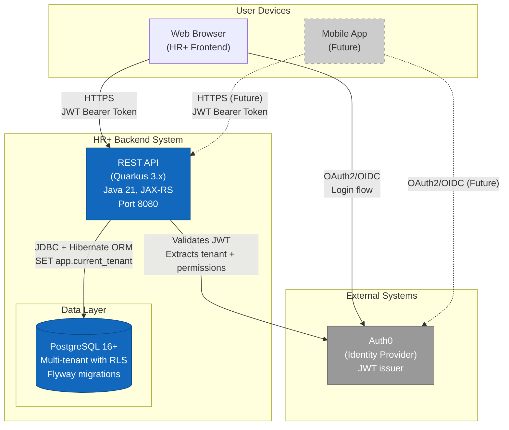
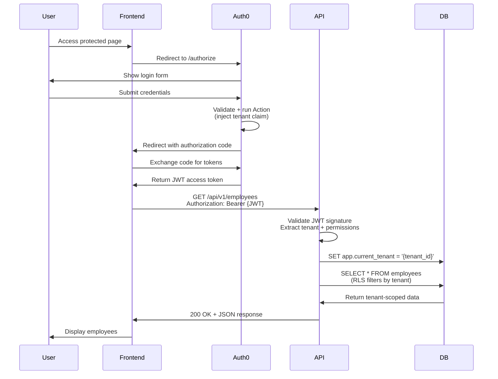
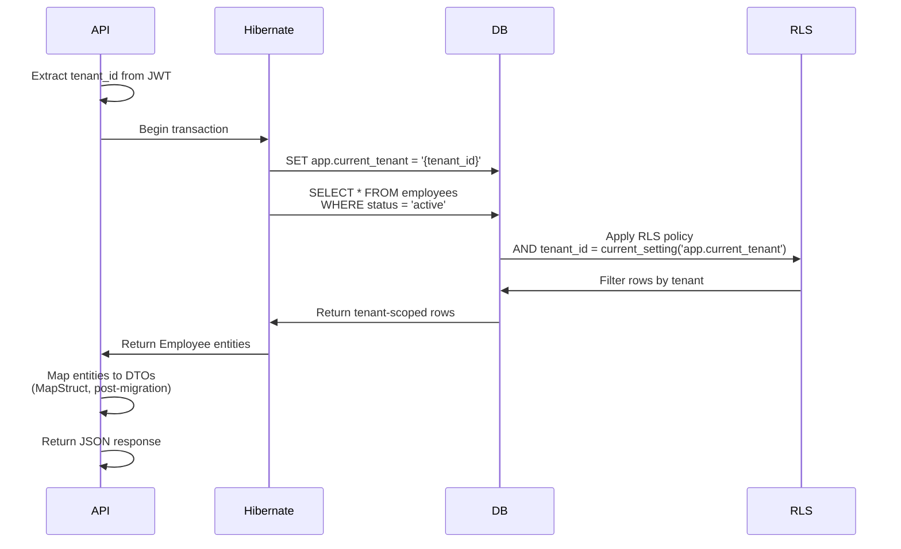

# C4 Model - Level 2: Container Diagram

**System:** HR+ Backend  
**Level:** Container (System decomposition)  
**Audience:** Technical stakeholders, architects, senior developers

---

## Overview

The HR+ Backend system is decomposed into the following containers:

1. **Web Application (Quarkus)** - RESTful API server handling all business logic
2. **PostgreSQL Database** - Primary data store with Row-Level Security (RLS)
3. **Auth0** - External identity provider (JWT token issuer)

---

## Container Diagram



---

## Container Descriptions

### 1. REST API (Quarkus Application)

**Technology Stack:**
- **Framework:** Quarkus 3.16.0 (Java 21)
- **Web Layer:** JAX-RS (RESTEasy Reactive)
- **ORM:** Hibernate ORM with Panache
- **Validation:** Hibernate Validator (Bean Validation)
- **Security:** Quarkus OIDC (JWT validation)
- **API Documentation:** SmallRye OpenAPI + Swagger UI
- **Database Migrations:** Flyway
- **Build Tool:** Maven
- **Deployment:** Docker (fast-jar mode)

**Responsibilities:**
- Exposes 57 RESTful endpoints (10 resource groups)
- Validates JWT tokens from Auth0
- Extracts tenant ID and permissions from JWT claims
- Enforces multi-tenant data isolation via PostgreSQL RLS
- Implements business logic for HRIS domain
- Handles pagination, filtering, sorting for collections
- Returns structured error responses with error codes

**Port:** 8080 (HTTP, behind reverse proxy with TLS in production)

**Configuration:**
- Environment variables for all external dependencies
- Profiles: `dev` (local), `prod` (AWS ECS)
- Health checks: `/q/health/live`, `/q/health/ready`
- Metrics: Micrometer → CloudWatch (production)

---

### 2. PostgreSQL Database

**Technology:** PostgreSQL 16+ with Row-Level Security (RLS)

**Responsibilities:**
- Stores all business data (employees, contracts, positions, units, etc.)
- Enforces tenant isolation via RLS policies on all tables
- Provides composite primary keys `(id, tenant_id)` as defense-in-depth
- Manages schema versions via Flyway migrations
- Implements audit trails (`created_at`, `updated_at`)
- Supports soft deletes via status columns

**Schema Highlights:**
- **Multi-tenancy:** Single schema with RLS, session variable `app.current_tenant`
- **Tables:** 12 core entities (employees, contracts, job_positions, organizational_units, etc.)
- **Indexes:** Composite indexes on `(tenant_id, ...)` for all foreign keys and queries
- **Constraints:** Unique constraints include `tenant_id` to prevent cross-tenant collisions

**Connection:**
- JDBC URL with connection pooling (Agroal)
- SSL/TLS required in production
- Read replicas not currently used (future optimization)

---

### 3. Auth0 (External Identity Provider)

**Technology:** Auth0 SaaS (https://hrplus.auth0.com)

**Responsibilities:**
- Authenticates users via OAuth2/OIDC
- Issues JWT access tokens with custom claims:
  - `sub`: User ID (Auth0 user identifier)
  - `email`: User email address
  - `https://hrplus.api/tenant`: Tenant ID (UUID)
  - `https://hrplus.api/permissions`: Array of permission strings (`action:resource`)
- Manages user sessions, multi-factor authentication (MFA)
- Provides user management UI for tenant admins

**Integration:**
- **Token Validation:** Quarkus validates JWT signature using Auth0's JWKS endpoint
- **No direct API calls:** Backend only validates tokens, does not call Auth0 Management API
- **Tenant claim:** Custom claim injected via Auth0 Action (JavaScript hook)

---

## Container Interactions

### Authentication Flow



---

### Data Access Flow (Multi-Tenant)



---

## Deployment Architecture

### Local Development (docker-compose)

```yaml
services:
  postgres:
    image: postgres:16-alpine
    ports: ["5432:5432"]
    environment:
      POSTGRES_DB: hrplus
      POSTGRES_USER: hrplus
      POSTGRES_PASSWORD: hrplus
    volumes:
      - postgres_data:/var/lib/postgresql/data

  backend:
    build: .
    ports: ["8080:8080"]
    environment:
      QUARKUS_DATASOURCE_JDBC_URL: jdbc:postgresql://postgres:5432/hrplus
      QUARKUS_OIDC_AUTH_SERVER_URL: https://hrplus.auth0.com
    depends_on:
      - postgres
```

### Production (AWS ECS - Planned)

- **Compute:** ECS Fargate tasks (autoscaling 2-10 instances)
- **Database:** RDS PostgreSQL (Multi-AZ, automated backups)
- **Load Balancer:** ALB (Application Load Balancer) with TLS termination
- **Secrets:** AWS Secrets Manager (database credentials, Auth0 client secret)
- **Logs:** CloudWatch Logs (container stdout/stderr)
- **Metrics:** CloudWatch Metrics (via Micrometer)

**Note:** Terraform for AWS infrastructure does not yet exist (needs creation).

---

## Non-Functional Characteristics

### Scalability
- **Horizontal scaling:** Stateless API enables adding more containers
- **Database bottleneck:** Single PostgreSQL instance; RLS policies add ~5-10% overhead
- **Future optimization:** Read replicas for reporting queries, schema-per-tenant for large customers

### Security
- **Authentication:** JWT validation with signature verification (RS256)
- **Authorization:** Permission-based access control (PBAC) enforced at endpoint level
- **Tenant isolation:** Defense-in-depth with RLS + composite keys + application-level checks
- **Secrets management:** Environment variables only, no hardcoded credentials
- **TLS:** Required for all external connections (database, Auth0, client → API)

### Availability
- **Health checks:** Liveness probe (`/q/health/live`), readiness probe (`/q/health/ready`)
- **Database failover:** RDS Multi-AZ automatic failover (~30 seconds)
- **Graceful shutdown:** Quarkus drains in-flight requests before stopping
- **No single points of failure:** Multiple ECS tasks, ALB distributes traffic

### Performance
- **API latency:** Target p95 < 300ms for CRUD operations
- **Database connection pooling:** Agroal (min 5, max 20 connections)
- **Query optimization:** Composite indexes on `(tenant_id, ...)` reduce query time
- **Pagination:** Enforced on all collection endpoints (max 250 items per page)

---

## Technology Choices & Rationale

| Choice | Rationale | Alternatives Considered |
|--------|-----------|-------------------------|
| **Quarkus** | Fast startup, low memory footprint, native image support, excellent OpenAPI integration | Spring Boot (heavier, slower startup), Micronaut (less mature ecosystem) |
| **PostgreSQL RLS** | Built-in tenant isolation, no custom filtering in every query, proven for multi-tenancy | Schema-per-tenant (doesn't scale beyond ~50 tenants), discriminator column only (error-prone) |
| **Auth0** | Managed identity provider, reduces security maintenance, MFA/SSO out-of-the-box | Keycloak (self-hosted complexity), Custom JWT (reinventing the wheel) |
| **Hibernate Panache** | Simplifies repository pattern, reduces boilerplate, maintains type safety | JOOQ (too low-level), Spring Data JPA (tight Spring coupling) |
| **Flyway** | Declarative SQL migrations, version control friendly, widely adopted | Liquibase (XML verbosity), JPA schema generation (not production-safe) |
| **Docker fast-jar** | Faster build than native image (40s vs 5min), easier debugging, standard JVM performance | Native image (longer builds, reflection config complexity), JVM mode (slower startup) |

---

## Future Enhancements

1. **Asynchronous Processing:** Add message queue (SQS) for background jobs (email notifications, reports)
2. **Caching Layer:** Redis for session data, frequently accessed lookup tables
3. **Read Replicas:** Offload reporting queries to PostgreSQL read replicas
4. **GraphQL API:** Alternative to REST for frontend flexibility (Apollo Server)
5. **Mobile Backend:** Extend API for mobile app (push notifications, offline sync)
6. **Analytics Database:** Replicate data to Redshift/BigQuery for OLAP queries

---

## Related Documents

- **[C4 Context Diagram](./01-context.md)** - System-level view
- **[C4 Component Diagram](./03-component.md)** - Internal API structure (next)
- **[MapStruct Migration Guide](../MAPSTRUCT_MIGRATION.md)** - DTO mapping strategy
- **[OpenAPI Specification](../../src/main/resources/META-INF/openapi.yaml)** - API contract (generated)
