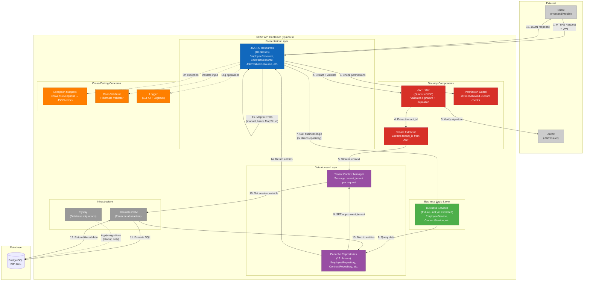
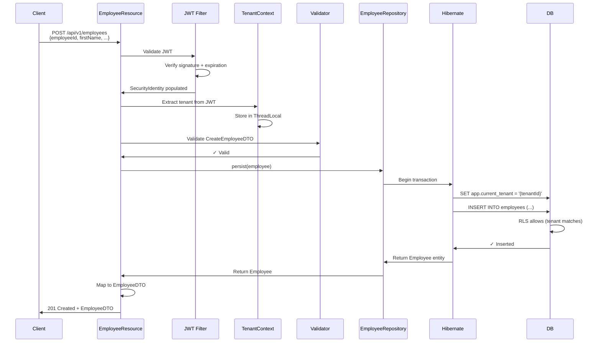

# C4 Model - Level 3: Component Diagram

**System:** HR+ Backend  
**Container:** REST API (Quarkus Application)  
**Level:** Component (Container decomposition)  
**Audience:** Software architects, developers implementing features

---

## Overview

The REST API container is decomposed into the following logical components:

1. **JAX-RS Resources** - HTTP endpoint controllers (10 resource classes)
2. **Business Logic Services** - Domain logic and orchestration
3. **Repository Layer** - Data access via Hibernate Panache
4. **Security Components** - JWT validation, tenant extraction, permission enforcement
5. **Cross-Cutting Concerns** - Exception handlers, validation, logging

---

## Component Diagram



---

## Component Details

### 1. JAX-RS Resources (Presentation Layer)

**Purpose:** HTTP endpoint controllers that handle REST requests/responses

**Implementation:**
- **Location:** `src/main/java/com/humanrsc/resources/`
- **Technology:** JAX-RS (RESTEasy Reactive)
- **Pattern:** One resource class per aggregate root

**Resource Classes (10):**

| Resource | Path | Endpoints | Responsibilities |
|----------|------|-----------|------------------|
| `EmployeeResource` | `/api/v1/employees` | 6 | CRUD for employees (GET, POST, PUT, DELETE), bulk operations |
| `ContractResource` | `/api/v1/employees/{id}/contracts` | 5 | Manage employment contracts per employee |
| `JobPositionResource` | `/api/v1/positions` | 5 | CRUD for job positions (puestos de trabajo) |
| `PositionCategoryResource` | `/api/v1/position-categories` | 5 | Manage position categories (categorías) |
| `OrganizationalUnitResource` | `/api/v1/units` | 6 | CRUD for organizational units (hierarchy) |
| `DependencyResource` | `/api/v1/dependencies` | 4 | Manage dependencies (direcciones, departamentos) |
| `ExternalPersonResource` | `/api/v1/external-persons` | 4 | CRUD for external persons (contractors, suppliers) |
| `SalaryHistoryResource` | `/api/v1/employees/{id}/salary-history` | 3 | Track salary changes per employee |
| `EmployeeAssignmentResource` | `/api/v1/employees/{id}/assignments` | 4 | Manage employee assignments to positions/units |
| `OrganizationResource` | `/api/v1/organization` | 15 | Meta-endpoints: statistics, bulk exports, reports |

**Current Implementation Pattern:**
```java
@Path("/api/v1/employees")
@Produces(MediaType.APPLICATION_JSON)
@Consumes(MediaType.APPLICATION_JSON)
public class EmployeeResource {
    
    @Inject
    EmployeeRepository repository;
    
    @GET
    @RolesAllowed("read:employees")
    public Response listEmployees(
        @QueryParam("page") @DefaultValue("0") int page,
        @QueryParam("size") @DefaultValue("50") int size) {
        
        // 1. Extract tenant from SecurityIdentity (already validated)
        String tenantId = extractTenantId();
        
        // 2. Set tenant context for RLS
        TenantContext.setCurrentTenant(tenantId);
        
        // 3. Query repository (RLS automatically filters)
        List<Employee> employees = repository.findAll(page, size);
        
        // 4. Map to DTOs (currently manual, future MapStruct)
        List<EmployeeDTO> dtos = employees.stream()
            .map(this::mapToDTO)
            .collect(Collectors.toList());
        
        // 5. Return JSON response
        return Response.ok(dtos).build();
    }
    
    // ... other endpoints
}
```

**Responsibilities:**
- Parse HTTP request (path params, query params, request body)
- Validate input (Bean Validation annotations)
- Extract tenant ID from `SecurityIdentity`
- Set tenant context for database queries
- Call business logic or repository
- Map entities to DTOs
- Return JSON response with appropriate status code
- Handle pagination, filtering, sorting

**Known Issues:**
- 12 endpoints currently accept JPA entities as request bodies (security vulnerability)
- Manual DTO mapping (verbose, error-prone)
- No service layer yet (business logic mixed in resources)

---

### 2. Security Components

#### 2.1 JWT Filter (Quarkus OIDC)

**Purpose:** Validates JWT tokens from Auth0 on every request

**Implementation:**
- **Technology:** Quarkus OIDC extension (`quarkus-oidc`)
- **Configuration:** `application.properties`
  ```properties
  quarkus.oidc.auth-server-url=https://hrplus.auth0.com
  quarkus.oidc.client-id=${AUTH0_CLIENT_ID}
  quarkus.oidc.credentials.secret=${AUTH0_CLIENT_SECRET}
  quarkus.oidc.token.issuer=https://hrplus.auth0.com/
  quarkus.oidc.token.audience=https://api.hrplus.com
  ```

**Validation Steps:**
1. Extract JWT from `Authorization: Bearer {token}` header
2. Fetch JWKS (public keys) from Auth0
3. Verify JWT signature (RS256)
4. Check expiration (`exp` claim)
5. Verify issuer (`iss` claim matches Auth0 URL)
6. Verify audience (`aud` claim matches API identifier)
7. Populate `SecurityIdentity` with claims

**On Failure:**
- Returns `401 Unauthorized` if token is missing/invalid/expired
- Does not retry or call Auth0 Management API

---

#### 2.2 Tenant Extractor

**Purpose:** Extracts tenant ID from validated JWT claims

**Implementation:**
- **Location:** `src/main/java/com/humanrsc/security/TenantContext.java`
- **Claim Paths:** Tries multiple fallback paths
  1. `https://hrplus.api/tenant` (custom namespace claim)
  2. `tenant_id` (standard claim)
  3. `tid` (short form)
  4. **Reject request if all missing** (no default tenant)

**Code Example:**
```java
public class TenantExtractor {
    
    public static String extractTenantId(SecurityIdentity identity) {
        JsonWebToken jwt = identity.getAttribute("json-web-token");
        
        // Try namespaced claim first
        String tenantId = jwt.getClaim("https://hrplus.api/tenant");
        
        // Fallback to standard claim
        if (tenantId == null) {
            tenantId = jwt.getClaim("tenant_id");
        }
        
        // Reject if still missing
        if (tenantId == null) {
            throw new UnauthorizedException("Missing tenant claim in JWT");
        }
        
        return tenantId;
    }
}
```

**Security Note:** Never uses a default tenant as fallback (prevents cross-tenant data access)

---

#### 2.3 Permission Guard

**Purpose:** Enforces permission-based access control (PBAC) at endpoint level

**Implementation:**
- **Standard:** `@RolesAllowed("read:employees")` on JAX-RS methods
- **Custom Checks:** Manual `SecurityIdentity.hasRole("action:resource")` for dynamic checks

**Permission Format:** `action:resource`
- Examples: `read:employees`, `write:positions`, `delete:contracts`, `stats:read`

**Permission Extraction:**
```java
public class PermissionExtractor {
    
    public static Set<String> extractPermissions(SecurityIdentity identity) {
        JsonWebToken jwt = identity.getAttribute("json-web-token");
        
        // Try namespaced claim first
        List<String> permissions = jwt.getClaim("https://hrplus.api/permissions");
        
        // Fallback to standard claim
        if (permissions == null) {
            permissions = jwt.getClaim("permissions");
        }
        
        return permissions != null ? new HashSet<>(permissions) : Collections.emptySet();
    }
}
```

**On Failure:**
- Returns `403 Forbidden` if user lacks required permission

---

### 3. Business Logic Layer (Services)

**Current Status:** Not yet implemented (business logic currently in resources)

**Future Structure:**
- **Location:** `src/main/java/com/humanrsc/services/`
- **Pattern:** One service per aggregate root
- **Responsibilities:**
  - Complex business rules (salary adjustments, contract validations)
  - Multi-entity operations (employee + contract + assignment)
  - Transaction boundaries (`@Transactional`)
  - Domain event publishing (future)

**Example Service (Future):**
```java
@ApplicationScoped
public class EmployeeService {
    
    @Inject
    EmployeeRepository employeeRepo;
    
    @Inject
    ContractRepository contractRepo;
    
    @Transactional
    public Employee hireEmployee(CreateEmployeeDTO dto, CreateContractDTO contractDto) {
        // 1. Validate business rules
        validateEmployeeId(dto.getEmployeeId());
        
        // 2. Create employee
        Employee employee = Employee.fromDTO(dto);
        employeeRepo.persist(employee);
        
        // 3. Create initial contract
        Contract contract = Contract.fromDTO(contractDto);
        contract.setEmployee(employee);
        contractRepo.persist(contract);
        
        // 4. Publish domain event (future)
        // eventBus.publish(new EmployeeHiredEvent(employee));
        
        return employee;
    }
}
```

---

### 4. Data Access Layer (Repositories)

#### 4.1 Panache Repositories

**Purpose:** Abstracts database queries using Hibernate ORM

**Implementation:**
- **Location:** `src/main/java/com/humanrsc/repositories/`
- **Technology:** Hibernate Panache (`PanacheRepository<Entity>`)
- **Pattern:** One repository per entity

**Repository Classes (12):**

| Repository | Entity | Custom Methods |
|------------|--------|----------------|
| `EmployeeRepository` | `Employee` | `findByEmployeeId()`, `findByStatus()`, `findByUnit()` |
| `ContractRepository` | `Contract` | `findActiveByEmployee()`, `findByType()` |
| `JobPositionRepository` | `JobPosition` | `findByCategory()`, `findByUnit()` |
| `PositionCategoryRepository` | `PositionCategory` | `findByParent()`, `findRootCategories()` |
| `OrganizationalUnitRepository` | `OrganizationalUnit` | `findByParent()`, `findByType()` |
| `DependencyRepository` | `Dependency` | `findByType()`, `findByParent()` |
| `ExternalPersonRepository` | `ExternalPerson` | `findByDocumentId()`, `findByType()` |
| `SalaryHistoryRepository` | `SalaryHistory` | `findByEmployee()`, `findLatestByEmployee()` |
| `EmployeeAssignmentRepository` | `EmployeeAssignment` | `findActiveByEmployee()`, `findByPosition()` |
| `ExtendedAttributeRepository` | `ExtendedAttribute` | `findByEntityType()`, `findByKey()` |
| `ExtendedValueRepository` | `ExtendedValue` | `findByAttribute()` |
| `TenantRepository` | `Tenant` | `findBySubdomain()` |

**Example Repository:**
```java
@ApplicationScoped
public class EmployeeRepository implements PanacheRepository<Employee> {
    
    public List<Employee> findByStatus(String status, int page, int size) {
        return find("status", status)
            .page(page, size)
            .list();
    }
    
    public Optional<Employee> findByEmployeeId(String employeeId) {
        return find("employeeId", employeeId)
            .firstResultOptional();
    }
    
    // Panache provides: persist(), update(), delete(), findAll(), findById()
}
```

**Multi-Tenancy Note:** Repositories do NOT add `tenant_id` filters manually; RLS handles this automatically.

---

#### 4.2 Tenant Context Manager

**Purpose:** Sets PostgreSQL session variable `app.current_tenant` per request

**Implementation:**
- **Location:** `src/main/java/com/humanrsc/security/TenantContext.java`
- **Pattern:** ThreadLocal storage + Hibernate interceptor

**Code Example:**
```java
public class TenantContext {
    
    private static final ThreadLocal<String> currentTenant = new ThreadLocal<>();
    
    public static void setCurrentTenant(String tenantId) {
        currentTenant.set(tenantId);
    }
    
    public static String getCurrentTenant() {
        return currentTenant.get();
    }
    
    public static void clear() {
        currentTenant.remove();
    }
}

@ApplicationScoped
public class TenantInterceptor {
    
    @Inject
    EntityManager em;
    
    public void setTenantForCurrentRequest() {
        String tenantId = TenantContext.getCurrentTenant();
        if (tenantId != null) {
            em.createNativeQuery("SET app.current_tenant = :tenantId")
                .setParameter("tenantId", tenantId)
                .executeUpdate();
        }
    }
}
```

**Execution Flow:**
1. Resource extracts tenant ID from JWT
2. Resource calls `TenantContext.setCurrentTenant(tenantId)`
3. Interceptor executes `SET app.current_tenant = '{tenantId}'` before first query
4. All subsequent queries inherit the session variable
5. RLS policies filter rows automatically

---

### 5. Cross-Cutting Concerns

#### 5.1 Exception Mappers

**Purpose:** Converts Java exceptions to structured JSON error responses

**Implementation:**
- **Location:** `src/main/java/com/humanrsc/exceptions/`
- **Technology:** JAX-RS `ExceptionMapper<T>`

**Mappers (5):**

| Mapper | Exception | HTTP Status |
|--------|-----------|-------------|
| `ValidationExceptionMapper` | `ConstraintViolationException` | 400 Bad Request |
| `NotFoundExceptionMapper` | `NotFoundException` | 404 Not Found |
| `UnauthorizedExceptionMapper` | `UnauthorizedException` | 401 Unauthorized |
| `ForbiddenExceptionMapper` | `ForbiddenException` | 403 Forbidden |
| `GenericExceptionMapper` | `Exception` | 500 Internal Server Error |

**Error Response Format:**
```json
{
  "error": "Validation Error",
  "message": "Employee ID already exists",
  "errorCode": "DUPLICATE_EMPLOYEE_ID",
  "field": "employeeId",
  "value": "EMP-001",
  "timestamp": "2026-04-01T12:34:56Z"
}
```

---

#### 5.2 Bean Validator

**Purpose:** Validates request DTOs using annotations

**Implementation:**
- **Technology:** Hibernate Validator (Bean Validation 3.0)
- **Annotations:** `@NotNull`, `@NotBlank`, `@Email`, `@Size`, `@Pattern`, custom validators

**Example DTO:**
```java
public class CreateEmployeeDTO {
    
    @NotBlank(message = "Employee ID is required")
    @Pattern(regexp = "^[A-Z0-9-]+$", message = "Invalid employee ID format")
    private String employeeId;
    
    @NotBlank(message = "First name is required")
    @Size(max = 100, message = "First name must be at most 100 characters")
    private String firstName;
    
    @Email(message = "Invalid email format")
    private String email;
    
    // ... getters/setters
}
```

**Validation Trigger:** Automatic on `@POST`/`@PUT` methods with DTO parameters

---

#### 5.3 Logger

**Purpose:** Structured logging for observability

**Implementation:**
- **Technology:** SLF4J + Logback
- **Format:** JSON logs in production (CloudWatch), plain text in dev
- **Levels:** ERROR (exceptions), WARN (business rule violations), INFO (CRUD operations), DEBUG (queries)

**Example:**
```java
@Inject
Logger log;

public Response createEmployee(CreateEmployeeDTO dto) {
    log.info("Creating employee: employeeId={}, tenantId={}", 
        dto.getEmployeeId(), TenantContext.getCurrentTenant());
    
    try {
        Employee employee = repository.persist(dto);
        log.info("Employee created: id={}", employee.getId());
        return Response.status(201).entity(employee).build();
    } catch (Exception e) {
        log.error("Failed to create employee: {}", e.getMessage(), e);
        throw e;
    }
}
```

---

### 6. Infrastructure Components

#### 6.1 Hibernate ORM

**Purpose:** Object-relational mapping (ORM) framework

**Configuration:**
- **Dialect:** PostgreSQL
- **DDL:** Validate only (Flyway handles schema)
- **Logging:** SQL queries logged in DEBUG mode
- **Connection Pool:** Agroal (min 5, max 20 connections)

---

#### 6.2 Flyway

**Purpose:** Database schema migration tool

**Configuration:**
- **Migration Location:** `src/main/resources/db/migration/`
- **Naming Pattern:** `V{version}__{description}.sql` (e.g., `V1.0.0__create_employees_table.sql`)
- **Execution:** Runs at application startup (before Hibernate validation)

**Migration Example:**
```sql
-- V1.0.0__create_employees_table.sql
CREATE TABLE employees (
    id UUID NOT NULL,
    tenant_id UUID NOT NULL,
    employee_id VARCHAR(50) NOT NULL,
    first_name VARCHAR(100) NOT NULL,
    last_name VARCHAR(100) NOT NULL,
    email VARCHAR(255),
    status VARCHAR(20) NOT NULL DEFAULT 'active',
    created_at TIMESTAMP NOT NULL DEFAULT NOW(),
    updated_at TIMESTAMP NOT NULL DEFAULT NOW(),
    PRIMARY KEY (id, tenant_id)
);

CREATE INDEX idx_employees_tenant_id ON employees(tenant_id);
CREATE UNIQUE INDEX idx_employees_employee_id_tenant_id ON employees(employee_id, tenant_id);

-- RLS Policy
ALTER TABLE employees ENABLE ROW LEVEL SECURITY;

CREATE POLICY tenant_isolation ON employees
    USING (tenant_id::TEXT = current_setting('app.current_tenant', true));
```

---

## Request Flow Example (Create Employee)



---

## Component Responsibilities Matrix

| Component | Responsibility | Multi-Tenancy Role | MapStruct Migration Impact |
|-----------|---------------|-------------------|----------------------------|
| **JAX-RS Resources** | HTTP handling, DTO mapping | Extracts tenant from JWT | HIGH - DTO mapping moves to MapStruct |
| **JWT Filter** | Token validation | Validates tenant claim presence | None |
| **Tenant Extractor** | Claim extraction | Primary tenant ID source | None |
| **Permission Guard** | Authorization checks | None (permissions are global) | None |
| **Business Services** | Business logic | Receives tenant from context | LOW - Uses repositories |
| **Repositories** | Data access | Calls TenantContext before queries | None |
| **Tenant Context** | Session variable | Sets `app.current_tenant` | None |
| **Hibernate** | ORM + SQL execution | Executes SET statement | None |
| **RLS Policies** | Row filtering | Enforces tenant isolation | None |
| **Exception Mappers** | Error responses | None | None |
| **Validator** | Input validation | None | LOW - Validates DTOs |

---

## Technology Stack Summary

| Layer | Technologies | Version |
|-------|-------------|---------|
| **Web Framework** | Quarkus, JAX-RS (RESTEasy Reactive) | 3.16.0 |
| **Security** | Quarkus OIDC, JWT (Auth0) | 3.16.0 |
| **ORM** | Hibernate ORM with Panache | 6.x (Quarkus bundled) |
| **Validation** | Hibernate Validator (Bean Validation) | 3.0 |
| **Database** | PostgreSQL (JDBC driver) | 16+ |
| **Migrations** | Flyway | 10.x |
| **Logging** | SLF4J + Logback | 2.x |
| **API Documentation** | SmallRye OpenAPI + Swagger UI | 3.x (Quarkus bundled) |
| **Build** | Maven | 3.9.x |
| **Runtime** | Java | 21 |

---

## Next Steps (Refactoring Roadmap)

1. **MapStruct Migration** (Priority: HIGH)
   - Replace manual DTO mapping with MapStruct mappers
   - Estimated: 13-21 days, 308 lines affected
   - See [MapStruct Migration Guide](../MAPSTRUCT_MIGRATION.md)

2. **Extract Service Layer** (Priority: MEDIUM)
   - Move business logic from resources to services
   - Define transactional boundaries
   - Estimated: 5-10 days

3. **Improve Error Handling** (Priority: MEDIUM)
   - Add more granular exception types
   - Include error codes in all responses
   - Estimated: 2-3 days

4. **Add Integration Tests** (Priority: HIGH)
   - Test multi-tenant data isolation
   - Test permission enforcement
   - Test RLS policies
   - Estimated: 10-15 days

5. **Performance Optimization** (Priority: LOW)
   - Add database indexes (already mostly done)
   - Implement caching (Redis) for lookups
   - Estimated: 3-5 days

---

## Related Documents

- **[C4 Context Diagram](./01-context.md)** - System-level view
- **[C4 Container Diagram](./02-container.md)** - Container decomposition
- **[MapStruct Migration Guide](../MAPSTRUCT_MIGRATION.md)** - DTO mapping refactoring
- **[OpenAPI Specification](../../src/main/resources/META-INF/openapi.yaml)** - API contract
